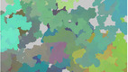
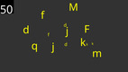

# Repositório de atividades do P5

[Códigos do FUNPROGRAMMING](./fun_programming.md)

## Mini Projetos

\________________________ | \_______________________________________________
------------------------- | -----------------------
 | [@015 Corações](base/015/Readme.md#corações)

## Conceitos Seleção

\________________________ | \_______________________________________________
------------------------- | -----------------------
 | [@000 Quadradinhos](base/000/Readme.md#quadradinhos)
 | [@001 Mosaico](base/001/Readme.md#mosaico)
 | [@002 RedGreen](base/002/Readme.md#redgreen)
 | [@003 Quadrantes](base/003/Readme.md#quadrantes)
 | [@004 DVD](base/004/Readme.md#dvd)
 | [@005 Ratinho](base/005/Readme.md#ratinho)
 | [@006 Distância](base/006/Readme.md#distância)
 | [@007 Granulado](base/007/Readme.md#granulado)
 | [@008 Limitar](base/008/Readme.md#limitar)
 | [@009 Prisão](base/009/Readme.md#prisão)
 | [@011 Timer](base/011/Readme.md#timer)

## Repetição

\________________________ | \_______________________________________________
------------------------- | -----------------------
 | [@010 Floresta](base/010/Readme.md#floresta)
 | [@012 Escada](base/012/Readme.md#escada)
 | [@013 Cortina](base/013/Readme.md#cortina)
 | [@014 Tabuleiro](base/014/Readme.md#tabuleiro)

## Mouse e Teclado

\________________________ | \_______________________________________________
------------------------- | -----------------------
 | [@016 Clique](base/016/Readme.md#clique)
 | [@017 Campo](base/017/Readme.md#campo)
 | [@018 Próximo](base/018/Readme.md#próximo)
 | [@019 Swap](base/019/Readme.md#swap)
 | [@020 Letras](base/020/Readme.md#letras)

