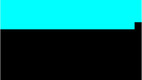
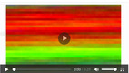
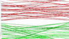
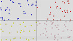
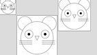

# Repositório de atividades do P5

## Conceitos iniciais

\________________________ | \_______________________________________________
------------------------- | -----------------------
 | [@000 Quadradinhos](base/000/Readme.md#quadradinhos)
 | [@001 Mosaico](base/001/Readme.md#mosaico)
 | [@002 RedGreen](base/002/Readme.md#redgreen)
 | [@003 Quadrantes](base/003/Readme.md#quadrantes)
 | [@004 DVD](base/004/Readme.md#dvd)
 | [@005 Ratinho](base/005/Readme.md#ratinho)
