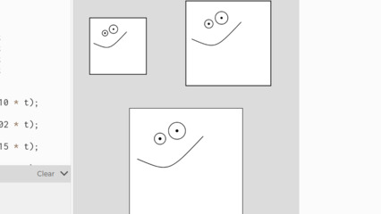

# Ratinho



Escreva uma função que faça um desenho qualquer dentro de um quadrado na posição x, y de tamanho w. Você pode utilizar o meu ratinho como exemplo. Pode fazer um desenho diferente e mais simples, mas deve ser dentro de um quadrado e utilizar os parâmetros x, y e w.

Aqui está um vídeo explicando como achar os pontos de forma parametrizada: [https://youtu.be/zLpGQPhnQW0](https://youtu.be/zLpGQPhnQW0)

## Exemplo do sorriso

```js
function setup() {
  createCanvas(400, 400);
  background(220);
}

function desenho(x, y, t) {
  square(x, y, t);
  let olhoxa = x + 0.27 * t;
  let olhoya = y + 0.27 * t;
  let olhoxb = x + 0.42 * t;
  let olhoyb = y + 0.20 * t;
  
  fill(255);
  circle(olhoxa, olhoya, 0.10 * t);
  fill(0);
  circle(olhoxa, olhoya, 0.02 * t);
  fill(255);  
  circle(olhoxb, olhoyb, 0.15 * t);
  fill(0);
  circle(olhoxb, olhoyb, 0.02 * t);
  fill(255);
  
  let sxa = x + 0.07 * t;
  let sya = y + 0.45 * t;
  let sxb = x + 0.35 * t;
  let syb = y + 0.57 * t;
  let sxc = x + 0.65 * t;
  let syc = y + 0.25 * t;
  bezier(sxa, sya, sxb, syb, sxb, syb, sxc, syc);
  
}

function draw() {
  desenho(30, 40, 100);
  desenho(200, 10, 150);
  desenho(100, 200, 200);
}
```
