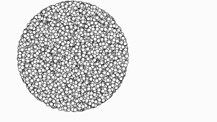

# Distância



## Intro

Você pode criar uma função em JavaScript para calcular a distância entre dois pontos usando a fórmula da distância euclidiana. A fórmula é dada por:


Em javascript, essas operações matemáticas podem ser invocadas a partir da biblioteca Math. Por exemplo, para calcular a raiz quadrada de um número, você pode usar a função `Math.sqrt()`. Para calcular o quadrado de um número, você pode usar a função `Math.pow()`. A distância entre dois pontos pode ser escrita como:

```js
Math.sqrt(Math.pow(x2 - x1, 2) + Math.pow(y2 - y1, 2));
```

Podemos empacotar esse código em uma função para calcular a distância entre dois pontos:

```js
function calc_distancia(x1, y1, x2, y2) {
  return Math.sqrt(Math.pow(x2 - x1, 2) + Math.pow(y2 - y1, 2));
}
```

Observe a palavra `return`, ela é responsável por retornar o valor da função. Sem ela, a função não retorna nada.

## Guide

- Utilize as variáveis ao invés de colocar os valores diretamente no código.
- Copie a função `calc_distancia()` para o seu código.
- Gere bolas aleatoriamente em qualquer lugar da tela.
- Desenhe apenas as bolas que estiverem a uma distância menor que 150px do centro da tela.

## Draft

```js
let larg = 400, prof = 400;
let radius = 150;

function setup() {
  createCanvas(larg, prof);
  circle(larg/2, prof/2, 2 * radius);
}

function draw() {
  
  let x = random(larg);
  let y = random(prof);

  if () {
    ellipse(x, y, 10);
  }
}
```
