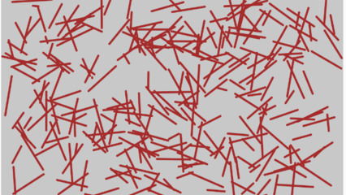

# Granulado

## Intro

Vamos fazer um granulado para cobertura do bolo.

## Guide

- Crie a tela e configure a cor de desenho para "brown" na função `setup`.
- Na função draw, gere dois pontos aleatórios dentro da tela.
- Se esses pontos estiverem a menos de 100 pixels um do outro, desenhe uma linha entre eles.
