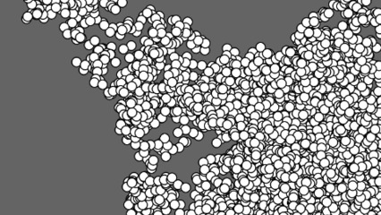

# Prisão

Vamos utilizar a função limitar da atividade @008 para manter uma bolinha inquieta dentro da tela.



## Draft

```js

let x = 200, y = 200, tam = 10;
let larg = 400, prof = 400;
function setup() {
  createCanvas(larg, prof);
  background(100);
}

function draw() {
  //faça o x variar de -tam até +tam utilizando o random
  //faça o y variar de -tam até +tam utilizando o random
  //chame a função limitar para limitar o x entre 0 e larg
    // x recebe o valor da função limitar(x, 0, larg)
  //chame a função limitar para limitar o y entre 0 e prof
    // y recebe o valor da função limitar(y, 0, prof)
  circle(x, y, tam);
}

function limitar(v, lower, upper) {
  //copiar da atividade 008
}
```
