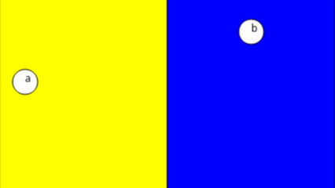

# Campo



[_]()

## Intro

Vamos aprender a controlar os botões do mouse.

## Instruções

- Crie variáveis para guardar as posições dos pontos `a` e `b`.

```js
let ax = 30, ay = 100;
let bx = 300, by = 40;
```

- Na função `draw`
  - Pinte a metade esquerda da tela de amarelo e a metade direita de verde.
  - Você pode desenhar um retângulo que cubra apenas uma parte da tela com a função `rect`.

```js
  fill(cor)
  rect(x, y, largura, altura)
```

- Na função `draw` desenhe círculos brancos de tamanho 20 nas posições `a` e `b`

```js
  fill("white");
  //desenhe círculo do ponto a
  //desenha círculo do ponto b
```

- Escreva o nome `a` no ponto `a` e o nome `b` no ponto `b` usando a função `text(texto, x, y)`.
  - Para trocar a cor do texto antes de escrever use a função `fill`.

- Agora implemente a função `mousePressed()`
  - Se você clicar na parte AMARELA
    - mova o ponto `a` para a posição do mouse
  - Se você clicar na parte VERDE
    - mova o ponto `b` para a posição do mouse
  - Para saber de que lado você clicou, verifique se a posição do mouse `mouseX` estava antes do meio da tela `larg / 2` usando um `if`.

## Draft

```js
let larg = 400, prof = 400;
let ax = 30, ay = 100;
let bx = 300, by = 40;

function setup() {
  createCanvas(larg, prof);
}

function draw() {
  background(255);
  //pintar as metades da tela

  //pintar os circulos

  //pintar os textos
}
function mousePressed() {
  if (/*mouseX for menor que a metade*/) {
    // mova o ponto a para mouseX e mouseY
  } else {
    // mova o ponto b para mouseX e mouseY
  }
}


```
