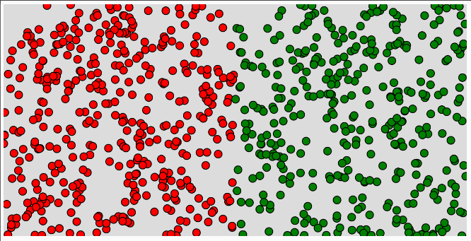
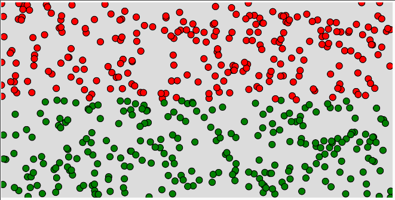
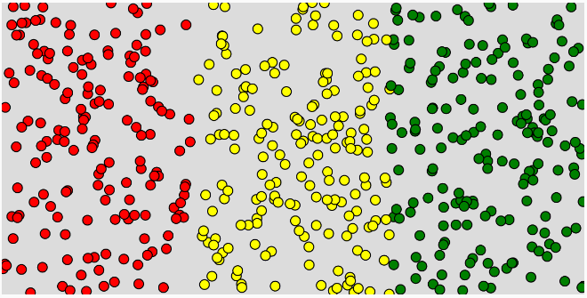
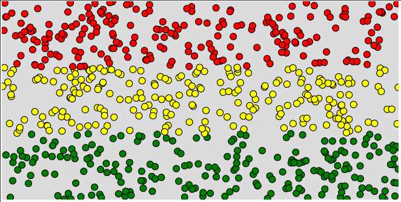
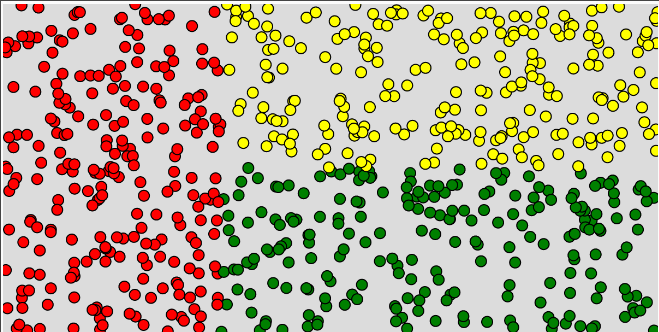
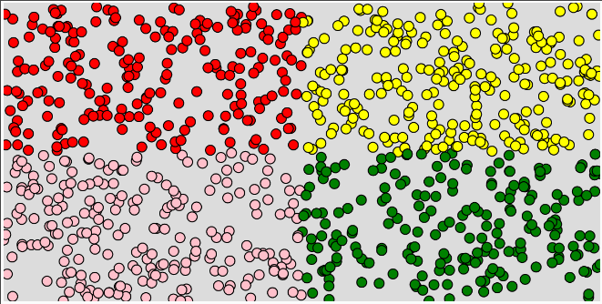
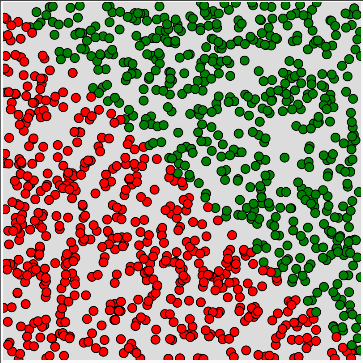
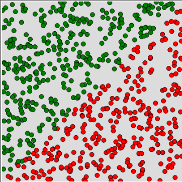
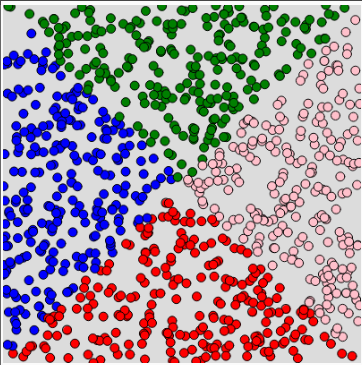
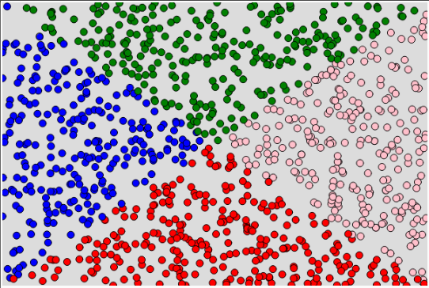

# @bandeiras

Partindo do código de geração de bolinhas, tente recriar os variados padrões de bandeiras solicitados.

## Rascunho

```js
let larg = 600, prof = 400;
function setup() {
  createCanvas(larg, prof);
  background(220);
}
function draw() {
  let x = random(larg);
  let y = random(prof);
  if (x < 300) {
    fill("blue")
  } else {
    fill("yellow")
  }
  circle(x, y, 10);
}
```

## Leste Oeste



## Norte Sul



## Leste Meio Oeste



## Norte Meio Sul



## Leste Norte Sul



## Quadrantes



## Diagonal



## Desafio 1: Contradiagonal



## Desafil 2: X



## Desafio 3: X não quadrado


